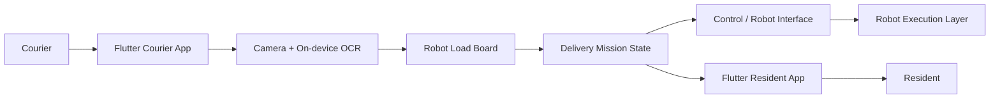

# Porter — Autonomous Last-mile Delivery App

아파트 단지의 **라스트마일 배송을 자동화**하기 위해 제작한 캡스톤 프로젝트의 Flutter 앱입니다.

택배 기사가 로비에서 배송물을 로봇에 적재하고 목적지를 등록하면, 배송 작업을 생성해 로봇 실행 단계와 연결하고 입주민은 배송 진행 상태와 도착 여부를 확인할 수 있도록 설계했습니다.

> 이 저장소는 프로젝트 전체 중 **Flutter 앱과 앱–제어 계층 인터페이스**를 담고 있습니다.  
> ROS2 기반 자율주행, 로봇암 제어 등 로봇 계층은 팀의 별도 구현 영역입니다.

---

## Overview

프로젝트의 목표는 기사가 아파트 내부를 반복 이동하는 시간을 줄이고, 로비 이후의 세대 앞 배송과 프레시백 회수 과정을 로봇으로 자동화하는 것이었습니다.

앱은 두 사용자 흐름으로 구성했습니다.

- **Courier App** — 로봇 선택, 배송물 적재, 송장 OCR, 목적지 등록, 배송 작업 시작 및 진행 상태 확인
- **Resident App** — 배송 현황, 도착 확인, 배송 이력, 프레시백 회수 요청

팀 최종 시연에서는 기존 기사 직접 수행 기준 약 **170초 → 31초**로 직접 작업 시간을 줄여 약 **82% 감소**한 시나리오 결과를 확인했습니다.

## My Role

제가 맡은 범위는 **Flutter 앱과 배송 mission/control interface**입니다.

- 기사 / 입주민용 Flutter UI 및 사용자 흐름 구현
- 사용자의 입력을 `robotId`, 목적지, 수량 등의 **배송 mission 상태**로 변환
- 배송 진행 단계를 앱 화면에 연결해 상태 변화를 추적할 수 있는 구조 구현
- 로봇별 적재 목록과 배송 완료 후 상태 정리 흐름 구현
- 카메라 촬영 → 온디바이스 OCR → 동/호수 파싱 → 적재 카드 반영 흐름 구현
- Wi-Fi/HTTP 기반 장비 통신 테스트 화면 구현 (`/status`, `/lock`, `/unlock`)
- 앱 계층과 로봇 실행 계층의 책임 범위를 분리해 인터페이스 관점에서 연결

로봇의 자율주행 알고리즘, ROS2 navigation, SLAM 및 로봇암 제어는 제 담당 범위가 아닙니다.

---

## Main Flow



현재 저장소의 앱 프로토타입에서는 배송 mission을 `ValueNotifier` 기반 in-memory store로 모델링하고, 로봇 통신은 별도의 Wi-Fi/HTTP 테스트 화면에서 상태 조회와 명령 송수신을 검증했습니다.

### Delivery Scenario

```text
배송물 접수
  ↓
로봇 선택 및 적재
  ↓
송장 촬영 / OCR 또는 목적지 직접 입력
  ↓
배송 mission 생성
  ↓
이동
  ↓
배송 층 도착
  ↓
세대 앞 배송 완료
  ↓
프레시백 회수
  ↓
복귀
```

---

## Key Features

### Courier

- 로봇 연결 및 상태 확인
- 로봇별 적재 현황 관리
- 카메라 기반 송장 촬영
- Google ML Kit 한국어 OCR
- OCR 결과에서 아파트 동 / 호수 추출
- 배송 대상 및 수량 입력
- 배송 mission 생성
- 배송 단계 타임라인 및 운영 로그 표시
- 배송 완료 시 적재 카드와 active mission 상태 정리
- 프레시백 회수 관리
- 장비 Wi-Fi/HTTP 통신 테스트

### Resident

- 현재 배송 상태 확인
- 배송 진행 단계 추적
- 문 앞 도착 상태 확인
- 배송 이력 조회
- 프레시백 회수 요청
- 사용자 정보 확인

---

## Engineering Highlights

### 1. User Input → Delivery Mission

기사의 화면 입력을 단순 UI 값으로 끝내지 않고 배송 작업을 표현하는 mission 상태로 변환했습니다.

```text
Robot + Building + Unit + Quantity
                ↓
        DeliveryMissionItem
                ↓
 moving → arrived → completed
```

`DeliveryMissionStore`에서 active mission과 history를 분리하고, 목적지와 로봇 기준으로 현재 작업을 조회할 수 있도록 구성했습니다.

### 2. OCR-assisted Loading Flow

배송물의 목적지를 매번 직접 입력하는 부담을 줄이기 위해 모바일 카메라와 온디바이스 OCR을 연결했습니다.

```text
Camera Capture
    ↓
Google ML Kit Text Recognition
    ↓
AddressParser
    ↓
동 / 호수 추출
    ↓
RobotLoadStore
```

OCR 결과를 그대로 사용하지 않고 주소 파싱 단계를 분리해, 인식된 문자열에서 실제 앱에 필요한 동/호수만 추출한 뒤 사용자가 확인하고 적재 카드에 반영하도록 구성했습니다.

### 3. Load State and Mission State Separation

로봇에 현재 실린 배송물과 진행 중인 배송 작업은 서로 다른 상태로 관리했습니다.

- `RobotLoadStore` — 로봇별 적재 배송물
- `DeliveryMissionStore` — 현재 배송 mission 및 완료 history

배송이 완료되면 해당 목적지의 적재 항목을 제거하고 mission을 history로 이동시켜 화면 상태가 함께 정리되도록 했습니다.

### 4. Wi-Fi / HTTP Device Communication Test

초기 Bluetooth 연결 방식에서 실제 운용 범위를 고려해 Wi-Fi 기반 통신으로 방향을 변경했습니다.

앱 내부 테스트 화면에서는 장비 서버 주소를 기준으로 다음 요청을 전송하고 응답 / 오류 / timeout을 로그로 확인할 수 있도록 했습니다.

```text
GET  /status
POST /lock
POST /unlock
```

연결 성공 여부뿐 아니라 `LOCKED`, `UNLOCKED`, `READY`, `ERROR` 등 장치 상태를 앱의 상태 값으로 변환하도록 구성했습니다.

### 5. Clear Control Boundary

이 프로젝트에서 제가 집중한 부분은 로봇 내부의 주행 알고리즘 자체가 아니라 **사용자 작업을 로봇이 실행할 수 있는 배송 작업의 형태로 연결하는 경계**였습니다.

```text
User Action
   ↓
Flutter UI
   ↓
Mission / Load State
   ↓
Communication Boundary
   ↓
Robot Execution Layer
```

이를 통해 앱의 화면 상태와 로봇 계층을 직접 결합하지 않고, mission과 통신 인터페이스를 기준으로 역할을 나누는 구조를 경험했습니다.

---

## Tech Stack

| Area | Stack |
| --- | --- |
| App | Flutter, Dart |
| UI | Material 3 |
| Camera | `camera` |
| OCR | Google ML Kit Text Recognition |
| Networking | HTTP, Wi-Fi |
| State Prototype | `ValueNotifier` based stores |
| Target Platform | Android / iOS |

### Team-wide System

프로젝트 전체에서는 Scout Mini 기반 자율주행 로봇과 로봇암을 활용했습니다. 이 저장소는 그중 **모바일 앱 / 사용자 입력 / mission 상태 / 제어 인터페이스**에 해당하는 코드만 포함합니다.

---

## Project Structure

```text
lib/
├── apps/
│   ├── courier/
│   │   ├── courier_app.dart
│   │   └── screens/
│   └── resident/
│       ├── resident_app.dart
│       └── screens/
├── core/
│   ├── models/
│   ├── services/
│   │   ├── delivery_mission_store.dart
│   │   ├── robot_load_store.dart
│   │   └── label_ocr_service.dart
│   ├── theme/
│   ├── utils/
│   │   └── address_parser.dart
│   └── widgets/
├── main.dart
├── main_courier.dart
└── main_home.dart
```

---

## Run Locally

```bash
flutter pub get
flutter run
```

OCR 기능은 실제 카메라 권한과 모바일 디바이스 환경이 필요합니다.

---

## Notes

- 캡스톤 수업에서 제작한 **팀 프로젝트**입니다.
- 본 저장소의 중심은 최종 서비스용 백엔드 전체 구현이 아니라 **Flutter 앱과 배송 mission/control interface 프로토타입**입니다.
- 앱 내부의 mission store는 데모 및 인터랙션 검증을 위한 in-memory 상태 구조입니다.
- 로봇 자율주행 / 로봇암 제어 코드는 본 저장소에 포함되어 있지 않습니다.
- 프로젝트 전체 결과와 팀 기술 범위는 앱 저장소의 개인 구현 범위와 구분해 설명했습니다.
